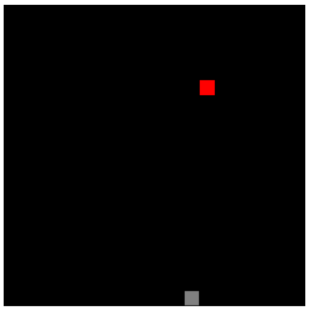

<h1 id="title" align="center">
  Snake Game 🐍
</h1>

## 💻 Detalhes do projeto

<span>Aplicação</span> desenvolvida no tutorial do YouTube [Snake Game com JavaScript ( Jogo da Cobrinha )- Programador Br - Ep.29](https://www.youtube.com/watch?v=Hua1OSXitdQ) no canal [Programador Br](https://www.youtube.com/@Programadorbr). Recriado o jogo clássico da cobrinha (snake game).

<h1 align="center">
    
</h1>

## 📚 Informações sobre o projeto

Criada no intuito de praticar os conhecimentos de HTML, CSS e JavaScript. O objetivo do jogo é fazer a cobrinha capturar o máximo possível de frutos que surgirem no tabuleiro, quanto mais ela ingerir maior ela ficará. Deve evitar de colidar com o próprio corpo, pois o jogo acabará.

## :rocket: Tecnologias utilizadas no projeto

As tecnologias/ferramentas utilizadas no projeto foram:

- [HTML5](https://developer.mozilla.org/en-US/docs/Web/Guide/HTML/HTML5)
- [CSS3](https://developer.mozilla.org/en-US/docs/Web/CSS)
- [JavaScript](https://developer.mozilla.org/en-US/docs/Web/JavaScript)

## 👨🏻‍💻 Lista de ajustes e melhorias a serem feitas

O projeto ainda está em desenvolvimento e as próximas atualizações serão voltadas nas seguintes tarefas listadas abaixo:

- [ ] Criar pontuação
- [ ] Modificar a cor da snake
- [ ] Passagem pelo tabuleiro
- [ ] Mensagem para inicar o jogo
- [ ] Mensagem quando termina o jogo
- [ ] Controle da velocidade da snake

## :package: Como utilizar o projeto

É preciso ter instalado no computador o [Git](https://git-scm.com) e o [Node.js](https://nodejs.org/) para clonar e executar o projeto. O projeto pode ser baixado com as linhas de comando ou no formato zip clicando no botão "Code" na opção "Download ZIP"

```bash

    # Clonar o repositório
    $ git clone https://github.com/alexvieirasj/snake-game.git

    # Entrar no diretório baixado
    $ cd snake-game

    # Para executar a aplicação abra o arquivo snake.html no seu navegador
    
    # running on localhost
```

## 🤝 Colaboradores

Agradecemos às seguintes pessoas que contribuíram para este projeto:

<table>
  <tr>
    <td align="center">
      <a href="#">
        <br>
        <sub>
          <b>Alex Vieira</b>
        </sub>
      </a>
    </td>
  </tr>
</table>

## 😄 Seja um dos contribuidores<br>

Quer fazer parte desse projeto? Clique [AQUI](CONTRIBUTING.md) e leia como contribuir.

## 📝 Licença

Esse projeto está sob licença. Veja o arquivo [LICENÇA](LICENSE.md) para mais detalhes.

[⬆ Voltar ao topo](#title)

